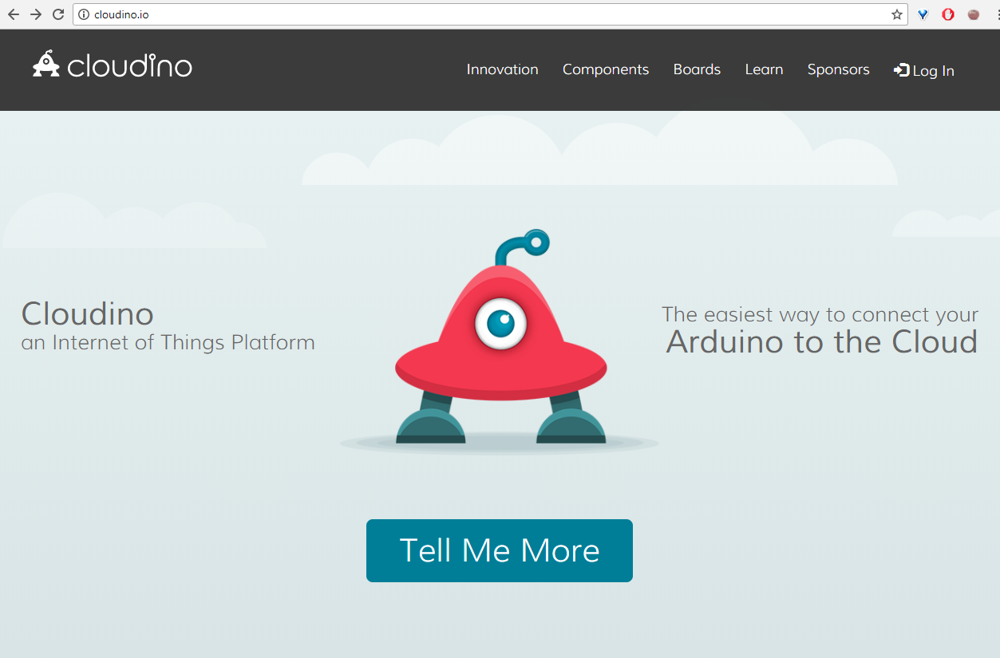
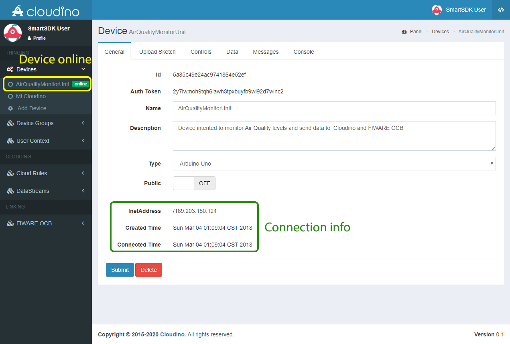
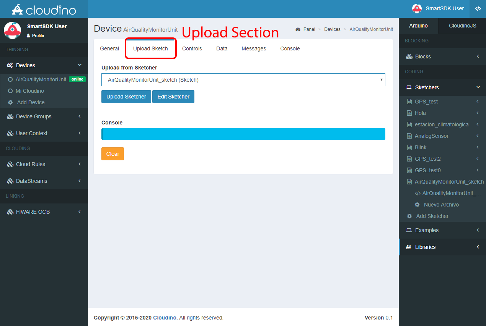

# Cloudino で大気質センサを作成

## Cloudinoで大気質センサを作成

このガイドは、IoT Agent である Cloudino を使用してセンサを遠隔監視し、データを FIWARE プラットフォームに送信する独自の大気センサ・ユニットを作成するのに役立ちます。

Cloudino WiFi Connectorは、実在のオブジェクトをインターネットに直接、またはネットワークレイヤ専用の追加マイクロコントローラとして、Arduino のような実際のマイクロコントローラ・ソリューションと並行して通信するスタンドアロン・デバイスとして使用できます。

## 注文する必要があるもの

Arduino を使用している間、Cloudino WiFi Connector は、IoT プロトコルを含むネットワーク層にのみ専用の別のプロセッサとして動作し、Arduino はセンサやアクチュエータとの接続に専念し、WiFi や Cloud 経由で Arduino を再プログラミングできます。

このようにして、Arduino と互換性のあるセンサを接続し、Cloudino および FIWARE プラットフォームを通じてデータを処理することができます。

このガイドでは、以下のコンポーネントを使用して、大気質センサユニットを開発します :

* [Cloudino WiFi Connector (CWC)](http://cloudino.io).
* [Arduino UNO](https://store.arduino.cc/usa/arduino-uno-rev3).
* [PPD42NS](https://www.mouser.com/ds/2/744/Seeed_101020012-1217636.pdf). PM10 センサ
* [DHT11](http://www.micropik.com/PDF/dht11.pdf). 温度 / 湿度センサ
* [MQ-131](https://www.compel.ru/item-pdf/cf02de305c8369719f27e4149395c6da/pn/winsen~mq131-high-concentration-ozone-gas-sensor.pdf). オゾン・センサ
* [Grove Multichannel](http://cdn-reichelt.de/documents/datenblatt/A300/101020088_01.pdf). ガス・センサ (NO2, CO)

地元の電子ショップやオンラインでいくつかの場所でコンポーネントを見つけることができます :

* <https://www.robotshop.com/>
* <https://www.seeedstudio.com/>
* <https://www.sainsmart.com/>
* <https://store.arduino.cc/usa/arduino-uno-rev3>
* <https://www.sparkfun.com/products/13678>

Cloudino は、開発者 <javier.solis@infotec.mx>, <victor.hernandez@infotec.mx> に連絡することによって直接取得することができます。または [Cloudinoのドキュメント](https://github.com/Cloudino/Cloudino-Doc/wiki/Make-your-first-Cloudino)の指示に従って、[ESP8266](https://www.sparkfun.com/products/13678) を使って独自の Cloudino デバイスを構築することもできます。

## 大気質センサの追加方法

図1は、Arduino UNO Board が CWC に沿った温度、湿度、CO、オゾン、NO2 および ダスト (PM10) を測定する、4つのセンサを接続する大気質ユニットの模式図を示しています。[cloudino.io](http://cloudino.io/) ポータルを使用して情報をクラウドに共有します。

  
  *Fig. 1. Air monitoring unit diagram*

提案された回路図はガイダンス/教育目的を意図しており、その構成要素は容易に見つけることができます。ただし、Arduino ボードに追加の電子部品を組み込んで、より複雑なシステムを作成し、測定結果を Cloudino と FIWARE の両方のプラットフォームに送信することができます。

## インストールと設定方法

### cloudino.io でアプリケーション開発環境を作成

Cloudino プラットフォームを使用するには、あらゆるデバイスを IoT に接続できるツールを含む [cloudino.io](http://cloudino.io/) ポータルにアクセスする必要があります。

  
  *Fig. 2. Cloudino.io Portal*

まず、アカウントを作成し、プラットフォームにログインして、クラウドデバイス、クラウディング・ルール、[FIWARE Orion Context Broker (OCB)](https://fiware-orion.readthedocs.io) 接続を管理する設定セクション、および、メインのスタート・ガイドを参照する必要があります。

  
  *Fig. 3. Login page*

  
  *Fig. 4. Cloudino.io User's Main page*

大気センサユニットを Cloudino プラットフォームに接続するには、Cloudino Wifi Connector をポータルに設置する必要があります。**CWC は、あらゆるデバイスを IoT に接続できる Cloudino 技術を備えたハードウェアです**。

  
  *Fig. 5. Cloudino Wifi Connector*

左側のパネルから "Devices" メニューを選択し、"Add Device" オプションをクリックします。次に、名前、説明、およびハードウェア・タイプの設定を行います。この場合、Arduino UNO は、図1に示すように、大気質センサ・ユニットを開発するために使用します。**リストから使用する適切なハードウェア・タイプ (Arduino) を選択するか、Cloudino をスタンドアロン・デバイスとして使用する必要があります**。"Submit" ボタンをクリックすると、デバイスが作成されます。必要な数の CWC デバイスを登録できます。

  
  *Fig. 6. CWC device registered*

作成後、図8に示すようにデバイスを構成、制御、プログラムするためにいくつかのセクションが表示されます。

  
  *Fig. 7. CWC General Information*

"General" ビューには、デバイスの ID、認証トークン (Auth Token) 、名前、説明、タイプ、セキュリティレベル (公開または非公開) が表示されます。この情報は、後でポータルで作成されたデバイスに CWC を関連付けるために使用します。

### cloudino.io ポータルに Cloudino Wifi Connector を接続

ポータルにデバイスを作成したら、以前の手順で生成した認証トークンを添付して CWC を関連付ける必要があります。このようにして、大気質ユニットは Cloudino プラットフォームに接続されます。

このアクションを実行するには、CWC を 5V 電源に接続します。CWC 設定パネルにアクセスするために接続する必要のある WiFi ネットワークが作成されます。**WiFi ネットワークの SSID は、CWC デバイスのシリアル番号であり、パスワードなしで作成されます**。

  
  *Fig. 8. WiFi network generated by any CWC*

例えば、図8は、特定の CWC (Cloudino_FAAE37 デバイス) を構成するために使用される Cloudino_FAAE37 ネットワークを示しています。

WiFi 接続が確立されるとすぐに、設定パネルが表示されます。それが起こらない場合は、**192.168.4.1** の IP アドレスを Web ブラウザでオープンし、パネルにアクセスできます。図9は、CWC の主な構成 Web ページを示しています。

  
  *Fig. 9. CWC Configuration Panel on 192.168.4.1*

この関連付けは、"Server Configuration / Cloudino Server" のサブ・メニューにある、"Cloudino Cloud Configuration" にアクセスすることで行います。Cloudino プラットフォームから生成された Auth トークンを "Auth Token" フィールドにコピー＆ペーストし、"Active" フィールドを "True" に変更し、図10のように "Save" ボタンをクリックする必要があります。

  
  *Fig. 10. Cloudino Cloud Configuration*

最後に、CWC は、Cloudino プラットフォームにデータを送信できるように、WiFi ネットワーク経由でインターネットにアクセスするように設定する必要があります。"WiFi Configuration" メニューに移動し、利用可能な WiFi ネットワークをスキャンし、選択した WiFi ネットワークに接続します。"Status" が **CONNECTED** に変更されたときに接続が正しいことを確認できます。

  
  *Fig. 11. WiFi Configuration Section.*

CWC と [cloudino.io](http://cloudino.io/) の間の接続は、Cloudino Cloud Configuration で "Active" 値が "True" に設定されている場合に確立されます。

### Cloudino Wifi Connector と cloudino.io の間の接続を確認

CWC が Cloudino Platform に接続されていることを確認するには、Cloudino Platform に再度ログインし、"Devices" メニューに移動する必要があります。接続が正常に機能している場合は、以前に作成したデバイスとは別に緑色の **"online"** 凡例が表示されます。

**コンピュータを CWC WiFi から適切に切断し、インターネット WiFi ネットワークに接続することに注意してください**

この時点で、Cloudino/Arduino の大気質センサ・ユニットは、[cloudino.io](http://cloudino.io/) ツールを使用してプログラムして制御する準備ができています。

  
  *Fig. 12. Cloudino device online and ready to be used.*

### cloudino.io の開発ツールを使用してアプリケーションのロジックを定義

CWC が cloudino.io に登録されると、IoT 大気質モニタリング・アプリケーションの動作を定義するために、関連するハードウェア "Arduino UNO" とセンサを 図1 に示すようにプログラムすることができます。

最初は、Arduino 技術と同じコンテキストと意味を持つスケッチ –project- を作成する必要があります。**</>** アイコンで示されたドロップダウンメニューから **"Arduino"** セクションを選択し、 **"Sketchers"** に移動します。ここで、Cloudino テクノロジーで Arduino ボードで使用するプロジェクトを作成または編集できます。図13に示すように、**"Add Sketcher"** オプションを選択します。

  
  *Fig. 13. Add Sketcher option in the Arduino menu*

次に、Arduinoボードを制御するプログラムのスケッチの名前を入力して、"Submit" ボタンを押すと、スケッチャー領域が図14,15に示すように表示されます。

  
  *Fig. 14. Define the name of your sketcher*

  
  *Fig. 15. Sketcher area: compile, save and delete your code*

"Sketcher" エリアでは、図15を参照して、Arduino、CWC、および大気質ユニットの遠隔監視用センサを制御するコードを記述することができます。コードの構文は Arduino の変種である Cloudino API (Application Programming Interface) に基づいており、これまでの Arduino ユーザや新しい Arduino ユーザが採用しやすくなっています。Cloudino API の詳しい説明は、<https://github.com/Cloudino/Cloudino-Doc> にあります。

以下では、大気質モニタリング・ユニットの開発に使用される Arduinoコード を見ることができます。これは、post メソッドを使用して図1に示されているセンサから取得した生の値を Cloudino プラットフォームに送信します。

```c++
#include <Cloudino.h>
#include <dht11.h>
#define DHT11PIN 7

Cloudino cdino;
dht11 DHT11;

const int analogPinO3 = A0;
const int analogPinCO = A3;
const int analogPinNO2 = A4;

void setup()
{
  cdino.setInterval(10000,getSensors);
  cdino.begin();
}

void getSensors()
{
   int chk = DHT11.read(DHT11PIN);
   cdino.post("temperature",String((float)DHT11.temperature,2));
   cdino.post("relativeHumidity",String((float)DHT11.humidity,2));
   cdino.post("O3",String(analogRead(analogPinO3)));
   cdino.post("CO",String(analogRead(analogPinCO)));
   cdino.post("NO2",String(analogRead(analogPinNO2)));
   cdino.post("PM10",String(digitalRead(8)));
}

void loop()
{
   cdino.loop();
}
```

**以前のコードは、独自のライブラリを使用して正しい温度と相対湿度を計算する DHT11 以外のセンサから生データを取得します。多くのセンサからの測定値を適切に表現するために、追加のライブラリが必要になることがあります**

スケッチのコードが記述されたら、それを保存し、Cloudino API と一貫性があることを確認するためにコンパイルする必要があります。このプロセスは、図16に示すように、"Compile" ボタンをクリックすることによって実行されます。 青色のボックス (コンソール) にはコンパイル・ステータスが表示されます。コンパイルのエラーと成功を確認できます。コンパイルの問題を解決するには、[Cloudino Web サイト](https://github.com/Cloudino/Cloudino-Doc)の Cloudino API を参照してください。

  
  *Fig 16. A sketch compiled with success*

これで、作成されたスケッチを実際のデバイスにロードする必要があります。これは、設定しようとする選択されたデバイス内の "Upload Sketch" セクションを使用して行います。

  
  *Fig. 17. “Upload Sketch” section from the selected device*

ユーザおよびサンプルによって作成されたスケッチのリストが示されています。"AirQualityMonitorUnit_sketch" という名前の最近作成されたスケッチを選択し、CWC メモリと Arduino ボードにコンパイルされたコードをフラッシュして開発された機能を実行するために、"Upload Sketcher" ボタンを押す必要があります。点滅が完了した後にアプリケーション・ロジックが保存されます。図18および図19は、上記のプロセスを示しています。

  
  *Fig. 18. Selecting a sketch for the device*

  
  *Fig. 19. Upload process of the sketch inside the CWC.*

この時点で、図1によるシステムの機能が動作しています。監視ステーションが電源供給され、インターネットに接続されている間に、cloudino.io サーバに測定値を送信することができます。データが観測され、遠隔で使用されるということです。開発されたコードは、図20に示すように、センサが毎秒報告する値を定期的に送信し、図20に示すように cloudino.io プラットフォームの **"Messages"** セクションに表示します。コンソールはCloudino の稼動中にリアルタイムで無期限に更新されます。

  
  *Fig. 20. Real-time measurements from your AirQuality monitoring unit*

## IoT Agent としての Cloudino

Cloudino 自体は、IoT Agent として動作し、FIWARE と連携することができます。Cloudino プラットフォームは、一連の簡単なステップの後に、FIWARE Orion Context Broker に接続することができます。

Cloudino で開発した大気質ステーションのデータを FIWARE プラットフォームと共有するには、まず **"FIWARE OCB"** メニューに入り、**"Add Entity"** オプションを選択する必要があります。このセクションでは、FIWARE プラットフォームとのリンクを定義するのに役立ちます。図21に示すように、リンクの名前、記述を定義し、プラットフォームに関連付けるデバイス (CWC) を選択する必要があります。このようにして、Cloudino によって収集されたデータを FIWARE プラットフォームと共有することができます。

  
  *Fig. 21. Creating a link with the FIWARE platform*

リンクが作成されると、設定パネルが表示され (図22)、リンクの有効化/無効化、FIWARE プラットフォームで共有されるエンティティ (データセット) の定義、OCB サーバ・アドレスの定義ができます適切な場合には、サーバに接続するために必要な認証データを送信するために使用されます。図22は、先に開発された大気質モニタリング・ユニットから得られた全てのデータを含むエンティティ "AirQualityMonitorUnit:Entity" の定義を示す。

  
  *Fig. 22. Configuration panel of the FIWARE OCB Link and entity definition*

次の JSON コードは、以前のステップ (図22) で作成された、エンティティ "AirQualityMonitorUnit:Entity" を示しています :

```json
{
  "id": "AirQualityMonitorUnit:Entity",
  "type": "AirQualityObserved",
  "address": {
    "type": "StructuredValue",
    "value": {
      "addressCountry": "MX",
      "addressLocality": "Ciudad de México",
      "streetAddress": "San Fernando"
      }
    },
    "dataSource": {
      "type": "text",
      "value": "Cloudino"
    },
    "dateObserved": {
      "type": "DateTime",
      "value": "2018-02-01T17:00:00-05:00"
    },
    "location": {
      "value": {
        "type": "Point",
        "coordinates": [-99.163309, 19.291001]
      },
      "type": "geo:json"
    },
    "temperature": {
      "type": "text",
      "value": "12.2"
    },
    "relativeHumidity": {
      "type": "text",
      "value": "0.54"
    },
    "O3": {
      "type": "number",
      "value": "1.6"
    },
    "CO": {
      "type": "number",
      "value": "1.7"
    },
    "NO2": {
      "type": "number",
      "value": "1.9"
    },
    "PM10": {
      "type": "number",
      "value": "3.5"
    }
  }
```

**Cloudino で使用される変数の名前は、FIWARE エンティティ・モデルの属性で定義された名前と等しくなければならないことに注意することが重要です**。

リンクを設定した後、"Active" オプションを **"ON"** に切り替え、FIWARE と共有するエンティティ (以前の JSON コード) を定義し、"Submit" ボタンをクリックする必要があります。大気質モニタリング・ユニットから FIWARE OCB にデータを自動的に提出し始めます。

操作を検証するために、前の図で定義された関連する OCB サーバ、つまり認証なしで<http://207.249.127.132:1026/v2> にアクセスできます。このようにして、図23は、実体で定義され、Cloudino に関連付けられたデータが、FIWARE OCB サーバ上でリアルタイムに表示および更新される方法を示します。

  
  *Fig. 23. Data of air quality monitoring unit in the FIWARe OCB*

図23からわかるように、大気質モニタリング・ユニットのデータは、以下の REST コールでアクセスすることができる : <http://207.249.127.132:1026/v2/entities/AirQualityMonitorUnit:Entity>

Cloudino プラットフォームを通じて制御される大気質モニタリング・センサのリアルタイム情報を見ることができます。この情報は、あらゆる種類の IoT アプリケーションで使用できるようになりました。

Cloudino で IoT アプリケーションを開発し、FIWARE プラットフォームと統合するための詳細は、こちらをご覧ください : <https://github.com/Cloudino/Cloudino-Doc>
