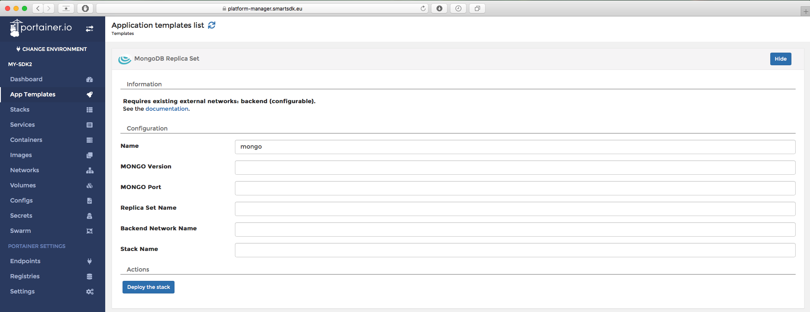
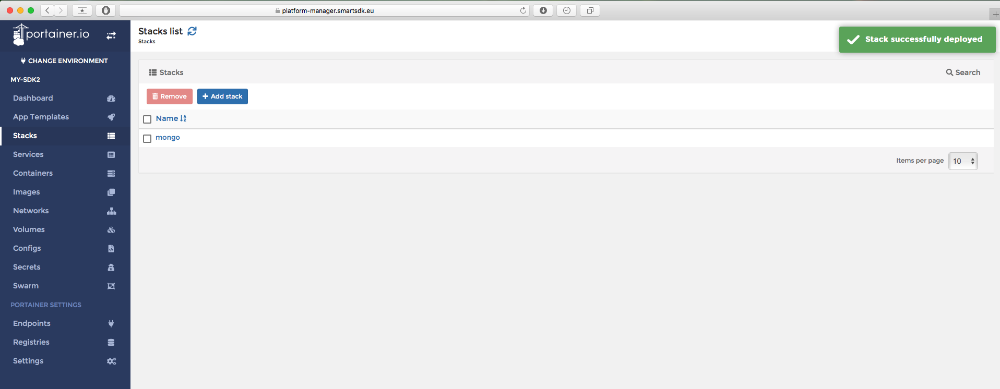
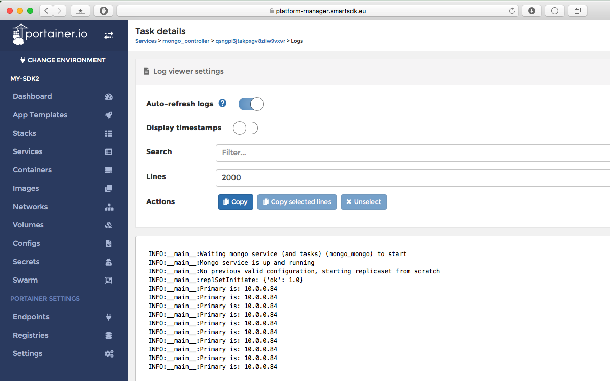
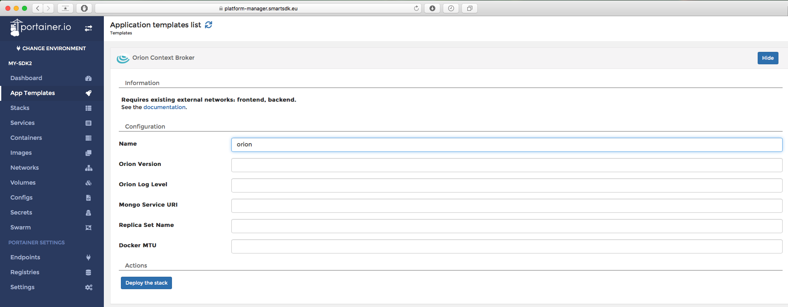
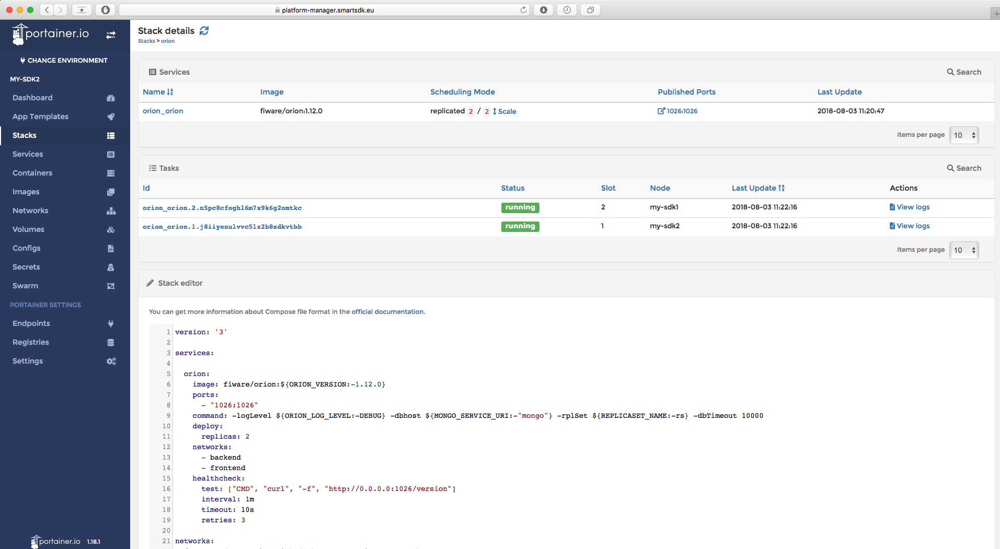
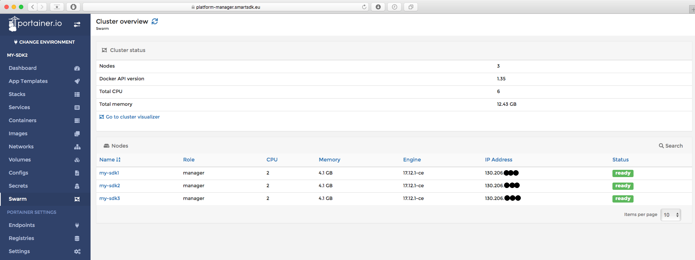
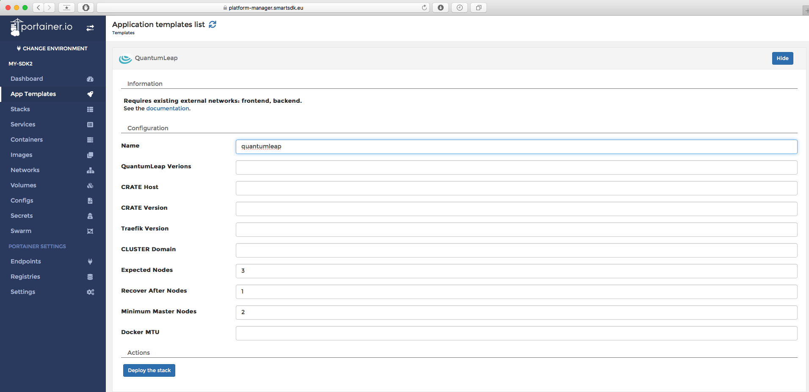
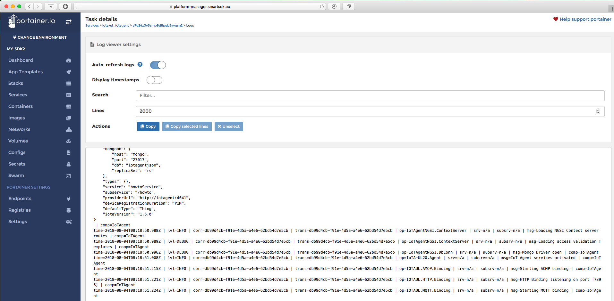

# Deploy your platform using SmartSDK recipes

## Prerequisites

### Checking access to your cluster

This section will guide you through the deployment of the core services.
It assumes you have already deployed your infrastructure, as instructed in
[this section](swarmcluster) of the guide. It also assumes you are
familiarized with [docker swarm clusters](https://docs.docker.com/engine/swarm/).

At this point, you should have your
[docker client installed](https://docs.docker.com/install/) and connected to
the docker engine where you will deploy your services. What does this mean? It
means you can execute docker commands locally and they will interact with your
docker swarm cluster. For example, if you created your swarm locally using
[miniswarm](https://github.com/aelsabbahy/miniswarm), you are now at the command
 line after executing the command `eval $(docker-machine env ms-manager0)`.

Let's make a quick test. Execute the following command...

```
$ docker node ls
```

If the above command does not return you the list of cluster nodes you were
expecting after having configured your cluster, something went wrong and you
should revisit [this section](swarmcluster/). In the miniswarm case, the
output would look like this...

```
$ docker node ls
ID                            HOSTNAME            STATUS              AVAILABILITY        MANAGER STATUS      ENGINE VERSION
txovguzi0bfjjg19dmia9ne9q *   ms-manager0         Ready               Active              Leader              18.04.0-ce
x319f02s5pgor5i6zxf3j1zfm     ms-worker0          Ready               Active                                  18.04.0-ce
quenm3mxoxkui913cqj6xj9e9     ms-worker1          Ready               Active                                  18.04.0-ce
```

### Checking the networks

The last step to double-check your environment is properly configured, is
to make sure you have the docker networks that services require. For this
guide, we have agreed on using two overlay networks called `backend` and
`frontend`.

If you are using the GUI, check you can see such networks from Portainer, as
instructed in [this section](swarmcluster).

If you are using the CLI, you can create them by running the following commands.

```
docker network create -d overlay --attachable --opt com.docker.network.driver.mtu=${DOCKER_MTU:-1400} backend
docker network create -d overlay --attachable --opt com.docker.network.driver.mtu=${DOCKER_MTU:-1400} frontend
```

This way, listing the docker networks you should see something like...

```
$ docker network ls
NETWORK ID          NAME                DRIVER              SCOPE
dyhk6vq4igln        backend             overlay             swarm
da6428f879fa        bridge              bridge              local
1c6264aa486f        docker_gwbridge     bridge              local
s6hn8feoikdr        frontend            overlay             swarm
df2a4f889f31        host                host                local
xv2z53zsiztb        ingress             overlay             swarm
5e4bb9a11160        none                null                local
```

### Getting the recipes (Optional)

This is necessary only if you plan to test things from the CLI.

```
$ git clone https://github.com/smartsdk/smartsdk-recipes.git
$ cd smartsdk-recipes/recipes/
```

NOTE: `smartsdk-recipes/recipes/` will be our "root" folder for this guide.

Finally, we are now ready to start deploying the main services composing the
overall SmartSDK architecture. Examples will be given using the CLI for a
miniswarm-based local cluster and using the UI of the Platform Manager with
Portainer.

## Deploy a Highly Available MongoDB Replicaset

### From the Command Line

Please execute the following commands...

```
$ cd utils/mongo-replicaset
```

In Linux/Mac...

```
$ source settings.env
$ docker stack deploy -c docker-compose.yml ${STACK_NAME}
```

In Windows...

```
$ settings.bat
$ docker stack deploy -c docker-compose.yml %STACK_NAME%
```

You should get the following output...

```
Creating config mongo-rs_mongo-healthcheck
Creating service mongo-rs_controller
Creating service mongo-rs_mongo
```

Finally, let's get back to our project "root"

```
$ cd ../../
```

The first time this will take a while until the images are pulled to the nodes.
You can check the progress by runnig...

```
$ docker service ls
ID                  NAME                  MODE                REPLICAS            IMAGE                                       PORTS
3chna7ohahrx        mongo-rs_controller   replicated          0/1                 smartsdk/mongo-rs-controller-swarm:latest
p6qex0jpp60o        mongo-rs_mongo        global              0/3                 mongo:3.2
```

To make sure the replica-set is properly established, after you see all replicas
are up and running (4 in total in the above example) check the output of the
logs of the replica-set controller, you shoul see a primary being elected.

```
$ docker service logs ${STACK_NAME}_controller
mongo-rs_controller.1.ooelrlkfujnn@ms-manager0    | INFO:__main__:Waiting mongo service (and tasks) (mongo-rs_mongo) to start
mongo-rs_controller.1.njolaq8j49tx@ms-manager0    | INFO:__main__:Waiting mongo service (and tasks) (mongo-rs_mongo) to start
mongo-rs_controller.1.njolaq8j49tx@ms-manager0    | ERROR:__main__:Expired attempts waiting for mongo service (mongo-rs_mongo)
mongo-rs_controller.1.ooelrlkfujnn@ms-manager0    | INFO:__main__:Mongo service is up and running
mongo-rs_controller.1.ooelrlkfujnn@ms-manager0    | INFO:__main__:No previous valid configuration, starting replicaset from scratch
mongo-rs_controller.1.ooelrlkfujnn@ms-manager0    | INFO:__main__:replSetInitiate: {'ok': 1.0}
mongo-rs_controller.1.ooelrlkfujnn@ms-manager0    | INFO:__main__:Primary is: 10.0.0.8
mongo-rs_controller.1.ooelrlkfujnn@ms-manager0    | INFO:__main__:To add: {'10.0.0.7', '10.0.0.6'}
mongo-rs_controller.1.ooelrlkfujnn@ms-manager0    | INFO:__main__:new replSetReconfig: {'ok': 1.0}
mongo-rs_controller.1.ooelrlkfujnn@ms-manager0    | INFO:__main__:Primary is: 10.0.0.8
```

NOTE: In windows use `%STACK_NAME%_controller` instead.

If you got something like that, your **MongoDB Replicaset** is ready!
If you still have issues or want to understand how this works in more detail,
please refer to [this section](https://github.com/smartsdk/smartsdk-recipes/tree/master/recipes/utils/mongo-replicaset)
 of the SmartSDK recipes documentation.

### Using Portainer

To deploy a stack from the UI, follow the “App Templates” link.


Select the one called "MongoDB Replica Set".

For this recipe, only the name is compulsory. Call it "mongo" for example.
The rest of the parameter can be used to customise your deployment, but you
can leave them empty because the underlying defaults are prepared to work with
this example.

**NOTE:** If you decide to name it somewhat different to `mongo`, set the same
string in the `Stack Name` variable before deployment.



Click on "Deploy the stack" and wait until it's deployed.



By clicking on the stack, you can see the status of the different containers.
It's OK if some get restarted the first time.
Check the logs of the controller to make sure the replica-set is properly
configured. You should see an election of the primary.



For more details of this recipe, please refer to [the recipe documentation](http://smartsdk-recipes.readthedocs.io/en/latest/utils/mongo-replicaset/readme/).

## Deploy a Highly Available Context Broker

### From the Command Line

Orion needs a MongoDB database to work. If you have been following this guide,
you should have already one replicaset running. The default configurations in
the settings files assume we will use those mongo instances.

To deploy Orion, please execute the following commands...

```
$ cd data-management/context-broker/ha/
$ source settings.env
$ docker stack deploy -c docker-compose.yml orion
$ cd ../../../
```

NOTE: In Windows, simply execute `settings.bat` instead.

The first time this will take a while until the images are pulled to the nodes.
With command `docker service ls` you can check if all the replicas are up or not.
After some minutes, when all replicas are up, you can check that Orion was
successfully deployed by checking its logs...

```
$ docker service logs orion_orion
orion_orion.2.yu0h9clplwms@ms-worker0    | time=Thursday 26 Apr 08:05:32 2018.325Z | lvl=INFO | corr=N/A | trans=N/A | from=N/A | srv=N/A | subsrv=N/A | comp=Orion | op=contextBroker.cpp[1835]:main | msg=Orion Context Broker is running
orion_orion.2.yu0h9clplwms@ms-worker0    | time=Thursday 26 Apr 08:05:32 2018.331Z | lvl=INFO | corr=N/A | trans=N/A | from=N/A | srv=N/A | subsrv=N/A | comp=Orion | op=mongoConnectionPool.cpp[217]:mongoConnect | msg=Successful connection to database
```

If you can see messages like those (Orion Running and connected to database),
your **Orion** is ready! However, if you still have issues or want to understand
 how this works in more detail, please refer to [this section](https://smartsdk-recipes.readthedocs.io/en/latest/data-management/context-broker/ha/readme/)
 of the SmartSDK recipes documentation.

### Using Portainer

For Orion use the “Orion Context Broker” template.

Again, with just providing a name like `orion` it is enough to get a successful
deployment. You can leave the rest of the variables in blank because the
underlying defaults will work with the default deployment of `mongo` of the
previous step. If you used a different name for `mongo`, use it in the
`MONGO_SERVICE_URI` variable of this deployment.

As always, a link to the documentation is provided in order to clarify the
exact meaning of the variables.



Click on “Deploy the stack” and wait a bit for the starting of the stack.

After a while you will be able to see multiple orion instances running.



Note that a configuration can be edited at any time in order to change suitable
parameters.

For sanity check, you should now be able to access this Orion from any device
connected to the internet. You can use the public IP of any of your swarm
cluster nodes and the port where Orion is listening (1026 by default).
The IP of the nodes can be seen through the "swarm" menu.



```
curl http://IP_OF_YOUR_CLUSTER:1026/version
```

## Deploy a Highly Available QuantumLeap

Quantumleap is built on top of a CrateDB cluster. Some values of the
configuration will depend on the number of nodes you have in your swarm cluster.

The default values will deploy a 1-node cluster, to make sure it works as
default for new users without much resources. However, if you know you cluster
has more nodes, you can adjust those values following the documentation below.

### Prerequisites

Crate needs a minimum of 262144 for the mmap count, which by default is lower in
Swarm nodes. Thus, before attempting to launch this service from the CLI, you
should run the following command in each of your swarm nodes.

Assuming you followed the miniswarm example, you will have to do...

```
$ docker-machine ssh ms-manager0 sudo sysctl -w vm.max_map_count=262144
$ docker-machine ssh ms-worker0 sudo sysctl -w vm.max_map_count=262144
$ docker-machine ssh ms-worker1 sudo sysctl -w vm.max_map_count=262144
```

For more info, checkout the corresponding [config documentation](https://crate.io/docs/crate/reference/en/latest/config/system.html?highlight=max_map_count)
of crate docs, or [this page](https://www.elastic.co/guide/en/elasticsearch/reference/current/vm-max-map-count.html)
from elasticsearch docs.

If you are using the GUI with Portainer in the FIWARE Lab, you do not need
to worry about this config because it is already being configured by the
FIWARE rancher driver during VMs creation.

### From the Command Line

To deploy Quantumleap, go to the recipe folder and mind the values in the
`settings.env` file we discussed before!.

```
$ cd data-management/quantumleap/
$ cat settings.env
```

If you want, adjust them following the official documentation of such variables.
For example, with a 3-nodes cluster, you can update the values in the
`settings` file of the following variables:

```
EXPECTED_NODES=3
RECOVER_AFTER_NODES=1
MINIMUM_MASTER_NODES=2
```

And now continue with the deployment of QL and Grafana, why not.

```
$ source settings.env
$ docker stack deploy -c docker-compose.yml quantumleap
$ docker stack deploy -c docker-compose-addons.yml grafana
$ cd ../../
```

The first time, this will take even longer than the previous services. Wait
until all replicas are up.

```
$ docker service ls
ID                  NAME                      MODE                REPLICAS            IMAGE                              PORTS
r6xoq2anisf6        grafana_grafana           replicated          1/1                 grafana/grafana:latest             *:3000->3000/tcp
0ys27a34jhy8        mongo-rs_controller       replicated          1/1                 smartsdk/mongo-rs-swarm:latest
udqr7mimjisi        mongo-rs_mongo            global              3/3                 mongo:3.2
natp6rgvb7pr        orion_orion               replicated          2/2                 fiware/orion:1.12.0                *:1026->1026/tcp
kh5yj8py63ll        quantumleap_crate         global              3/3                 crate:2.3.6
zn77x57xg3mc        quantumleap_quantumleap   replicated          2/2                 smartsdk/quantumleap:latest        *:8668->8668/tcp
n97db06olz7n        quantumleap_traefik       global              1/1                 traefik:1.3.5-alpine               *:80->80/tcp, *:443->443/tcp, *:4200->4200/tcp, *:4300->4300/tcp, *:8080->8080/tcp
```

You can check the status of your crate cluster by curling to the endpoint where
your cluster is deployed, using the header HOST as configured in your settings.

NOTE: Recall you must have activated `settings.env` in this same terminal.

```
$ IP_OF_MY_CLUSTER=$(docker-machine ip ms-manager0)
$ curl --header "Host: ${CRATE_HOST}.${CLUSTER_DOMAIN}" $IP_OF_MY_CLUSTER
```

Should return something like

```
{
  "ok" : true,
  "status" : 200,
  "name" : "Schwabenalpenkopf",
  "cluster_name" : "quantumleap",
  "version" : {
    "number" : "2.3.6",
    "build_hash" : "a51cbdc9c04cf9d601509cafb104bbbf2e5a2cf7",
    "build_timestamp" : "2018-04-04T13:14:42Z",
    "build_snapshot" : false,
    "es_version" : "5.6.8",
    "lucene_version" : "6.6.1"
  }
}
```

You can check QL is running by executing...

```
$ docker service logs quantumleap_quantumleap
quantumleap_quantumleap.1.tn4mcwvcj9ej@ms-worker1    |  * Running on http://0.0.0.0:8668/ (Press CTRL+C to quit)
```

And you should be able to access grafana with the explorer at the URL of your
cluster endpoint and port 3000. In the miniswarm example it typically ends up
being [http://192.168.99.100:3000](http://192.168.99.100:3000).

Congratulations, your **Quantumleap** deployment is ready! The usage of these
services will be covered in a different section of this guide.

If you still have issues or want to understand how this works in more detail,
please refer to [this section](https://github.com/smartsdk/smartsdk-recipes/tree/master/recipes/data-management/quantumleap)
 of the SmartSDK recipes documentation.

### Using Portainer

To deploy QuantumLeap please select the "QuantumLeap" template.

Again, you just need to give it a name (e.g., `quantumleap`) and that's it.
The rest of the values can be left in blank, the underlying default values will
work out-of-the-box.



If you have more than one cluster node, take this opportunity to adjust the
values of the following variables accordingly. For a 3-nodes cluster...

```
EXPECTED_NODES=3
RECOVER_AFTER_NODES=1
MINIMUM_MASTER_NODES=2
```

To determine these numbers for a different number of nodes, checkout
[these docs](http://smartsdk-recipes.readthedocs.io/en/latest/data-management/quantumleap/readme/#requirements).

Finally, you can deploy Grafana using the "QuantumLeap Addons" template. It
should not take a long time to startup.

You can check both QuantumLeap and Grafana by opening your explorer in the
following urls.

`http://IP-OF-ANY-SWARM-NODE:8668/v2/version`

`http://IP-OF-ANY-SWARM-NODE:3000/`

We encourage you to change the password of your deployed Grafana instance.
The default login credentials are documented [here](https://quantumleap.readthedocs.io/en/latest/admin/grafana/).

For more info, please refer to the [recipe documentation](http://smartsdk-recipes.readthedocs.io/en/latest/data-management/quantumleap/readme/).

## Deploy a Highly Available IoT Agent

### From the Command Line

Let's go to the folder of the IoT Agent of your choice, for example the `ul`.
The default values for the recipe are good enough for working with a MongoDB
and Orion Context Broker deployed following this guide.

```
$ cd iot-services/iotagent-ul
$ docker stack deploy -c docker-compose iota-ul
```

You can check the agent started properly by checking the replicas are up and
then looking at the service logs.

```
$ docker service logs iota-ul_iotagent
iota-ul_iotagent.1.v5ivpp3c3g58@ms-manager0    | time=2018-04-26T11:59:09.917Z | lvl=INFO | corr=eae6093a-15b6-4816-b1c0-1b2c9fe0a050 | trans=eae6093a-15b6-4816-b1c0-1b2c9fe0a050 | op=IoTAgentNGSI.DbConn | srv=n/a | subsrv=n/a | msg=Attempting to connect to MongoDB instance. Attempt 5 | comp=IoTAgent
iota-ul_iotagent.1.v5ivpp3c3g58@ms-manager0    | time=2018-04-26T11:59:09.969Z | lvl=INFO | corr=eae6093a-15b6-4816-b1c0-1b2c9fe0a050 | trans=eae6093a-15b6-4816-b1c0-1b2c9fe0a050 | op=IoTAgentNGSI.DbConn | srv=n/a | subsrv=n/a | msg=Successfully connected to MongoDB. | comp=IoTAgent
iota-ul_iotagent.1.v5ivpp3c3g58@ms-manager0    | time=2018-04-26T11:59:10.029Z | lvl=INFO | corr=eae6093a-15b6-4816-b1c0-1b2c9fe0a050 | trans=eae6093a-15b6-4816-b1c0-1b2c9fe0a050 | op=IoTAgentNGSI.NorthboundServer | srv=n/a | subsrv=n/a | msg=Starting IoT Agent listening on port [4041] | comp=IoTAgent
iota-ul_iotagent.1.v5ivpp3c3g58@ms-manager0    | time=2018-04-26T11:59:10.030Z | lvl=DEBUG | corr=eae6093a-15b6-4816-b1c0-1b2c9fe0a050 | trans=eae6093a-15b6-4816-b1c0-1b2c9fe0a050 | op=IoTAgentNGSI.NorthboundServer | srv=n/a | subsrv=n/a | msg=Using config:
iota-ul_iotagent.1.v5ivpp3c3g58@ms-manager0    |
```

Unfortunately there is no endpoint at the moment to check the successful
deployment of the Agent. However, if your container is stable and you can see
logs like those (Agent successfully connected to MongoDB), your **IoT Agent**
is probably ready! You will use it later on in this guide.

If you still have issues or want to understand how this works in more detail,
please refer to [this section](https://smartsdk-recipes.readthedocs.io/en/latest/iot-services/readme/)
 of the SmartSDK recipes documentation.

### Using Portainer

Finally, let's deploy an IOT Agent that would take care of adapting data coming
from devices in ultralightweight to NGSI data in Orion. You will find a
template called "IoT Agent - ul".

The deployment only requires a name. The rest of the parameters can be left in
blank for now.


After a while the stack should be deployed and running. You can check the logs
to make sure the Agent reached the mongo database deployed in earlier steps.
You should see something like this, where you check the configuration the agent
used and wether it managed to connect or not.



More info about this recipe can be found in the [IoT Agents recipes documentation](http://smartsdk-recipes.readthedocs.io/en/latest/iot-services/readme/).

## Exploring Further

This section was just a quick overview of the essentials to get you quickly up
and running. If you want to know more, you can find more info about the
deployment of FIWARE Services using Docker in the [smartsdk recipes repository](https://github.com/smartsdk/smartsdk-recipes).
The documentation for that repo is published [here](https://smartsdk-recipes.readthedocs.io/en/latest/).

Next sections of this guide will focus on how to use the services you have just
deployed and connected.
