# Creating your Air Quality Sensor with Cloudino

## Introduction

This guide will help you to create your own air quality sensor unit
using Cloudino, an IoT (Internet of Things) Agent, to remotely monitor your
sensors and send your data to the FIWARE platform.

The Cloudino WiFi Connector can be used as a standalone device to directly
communicate real-life objects to the internet or as an additional microcontroller
dedicated to the network layer, working in parallel with actual microcontroller
solutions like Arduino.

## What you need to order

While using with Arduino, the Cloudino WiFi Connector works as another processor
in parallel dedicated only to the network layer including the IoT protocols,
leaving the Arduino dedicated to connectivity with sensors and actuators and
allowing reprogramming Arduino via WiFi or Cloud.

In this manner, we can connect any sensor compatible with Arduino and process our
data through the Cloudino and FIWARE platforms.

For the purpose of this guide we will use the following components to develop our
air quality sensor unit:

* [Cloudino WiFi Connector (CWC)](http://cloudino.io).
* [Arduino UNO](https://store.arduino.cc/usa/arduino-uno-rev3).
* [PPD42NS](https://www.mouser.com/ds/2/744/Seeed_101020012-1217636.pdf). PM10 Sensor.
* [DHT11](http://www.micropik.com/PDF/dht11.pdf). Temperature / Humidity Sensor.
* [MQ-131](https://www.compel.ru/item-pdf/cf02de305c8369719f27e4149395c6da/pn/winsen~mq131-high-concentration-ozone-gas-sensor.pdf).
  Ozone Sensor.
* [Grove Multichannel](http://cdn-reichelt.de/documents/datenblatt/A300/101020088_01.pdf).
  Gas Sensor (NO2, CO).

You can find the components in your local electronic shop or online in several
places:

* <https://www.robotshop.com/>
* <https://www.seeedstudio.com/>
* <https://www.sainsmart.com/>
* <https://store.arduino.cc/usa/arduino-uno-rev3>
* <https://www.sparkfun.com/products/13678>

The Cloudino can be acquired directly by contacting the developer
<javier.solis@infotec.mx>, <victor.hernandez@infotec.mx>
or you can even build your own Cloudino device by using a [ESP8266](https://www.sparkfun.com/products/13678)
and following the instructions from the [Cloudino documentation.](https://github.com/Cloudino/Cloudino-Doc/wiki/Make-your-first-Cloudino)

## How to add Air Quality sensors

Fig. 1 shows the schematic model for an air quality unit where the Arduino UNO
Board connects 4 sensors that measures: temperature, humidity, CO, Ozone, NO2
and dust (PM10) along the CWC which allows us to automatically sense air quality
measurements and share the information to the cloud using
[cloudino.io](http://cloudino.io/) portal.

  
  *Fig. 1. Air monitoring unit diagram*

The proposed schematic is intended for guidance/educational purposes and its
components are easy to find; however, you can integrate any additional
electronic components to your Arduino board to create more complex systems and
post your measurements to both Cloudino and FIWARE platforms.

## How to install and configure it

### Create an application development environment at cloudino.io

In order to use the Cloudino Platform, it is necessary to access the
[cloudino.io](http://cloudino.io/) portal which includes the tools that allows
us to connect any device to IoT.

  
  *Fig. 2. Cloudino.io Portal*

Firstly you need to create an account and login to the platform where you will
find a configuration section to manage Cloudino devices, clouding rules and
[FIWARE Orion Context Broker (OCB)](https://fiware-orion.readthedocs.io)
connections as well as a main Getting Started guide.

  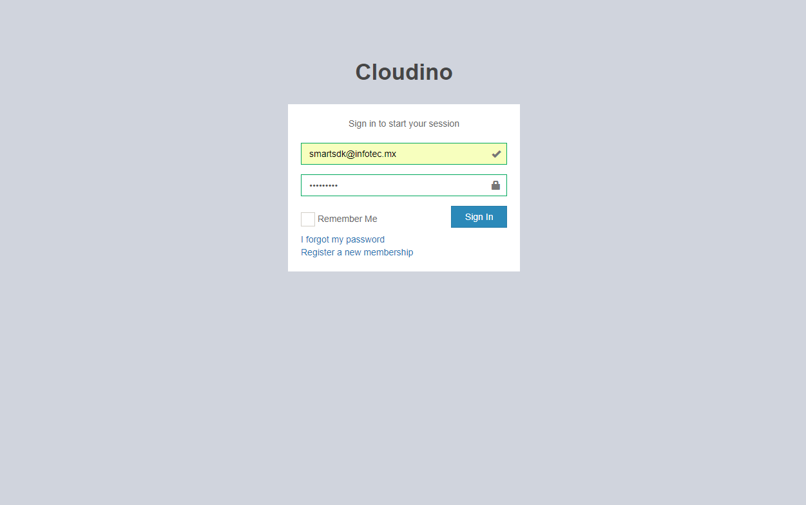
  *Fig. 3. Login page*

  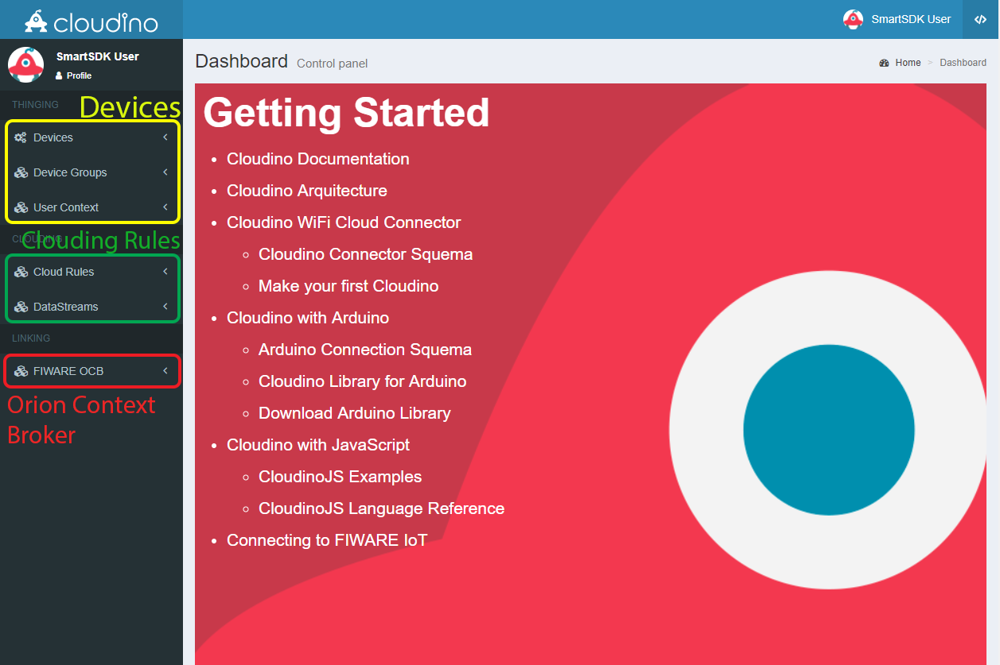
  *Fig. 4. Cloudino.io User's Main page*

To connect your air quality sensor unit to the Cloudino platform, the Cloudino
Wifi Connector needs to be set up in the portal. **CWC is the hardware with Cloudino
tecnology that allows you to connect any device to IoT**.

  
  *Fig. 5. Cloudino Wifi Connector*

From the left side panel, select the Devices Menu and click the "Add Device" option.
Then introduce a name, description and hardware type configuration; In this
case, an Arduino UNO will be used for developing our air quality sensor unit as
seen on Fig. 1. *You must select the proper hardware type (Arduino) to use from
the list or use Cloudino as standalone device*.
Click on the "Submit" button and our device will be created.
You can register as many CWCs devices as you need.

  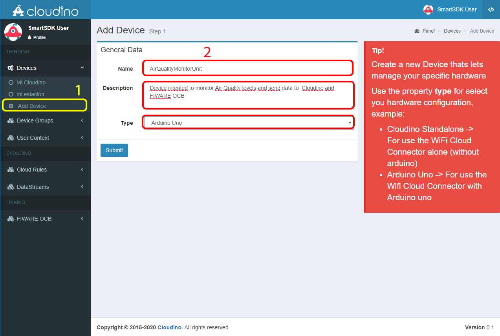
  *Fig. 6. CWC device registered*

After creation, several sections will be shown in order to configure, control
and program our device as seen on Fig. 8.

  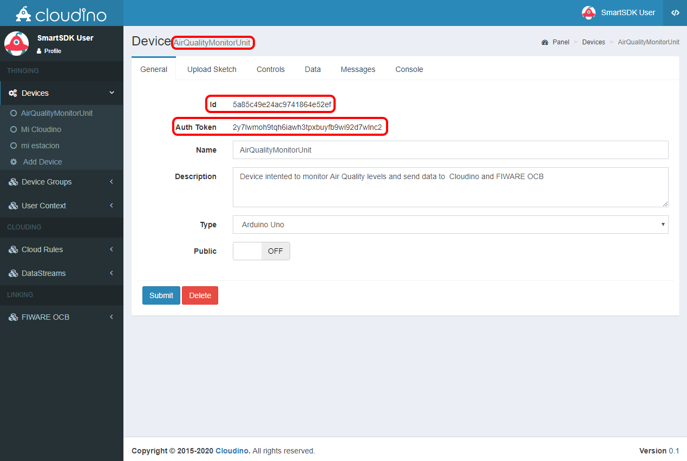
  *Fig. 7. CWC General Information*

The General View shows the device's id, authentication token (Auth Token), name,
description, type and security level (public or private). This information will
be used later to associate our CWC to the device created in the portal.

### Connect a Cloudino Wifi Connector to Cloudino.io Portal

Once you have created a device in the portal, it is necessary to associate the
CWC to it by attaching the Auth Token generated in the previous step.
In this way, our air quality unit will be connected to the Cloudino platform.

To perform this action, connect the CWC to a power source (5 volts). It will
create a WiFi Network on which we need to connect to access the CWC configuration
panel. **The WiFi network's SSID is the serial number of the CWC device and is
created without any password**.

  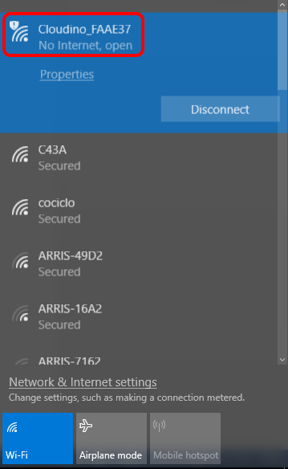
  *Fig. 8. WiFi network generated by any CWC*

For instance, Fig. 8 highligths Cloudino_FAAE37 network that is used to
configure the particular CWC (Cloudino_FAAE37 device).

As soon as the WiFi connection is made, a configuration panel shows up. In case
it doesn't happen, you can access to the panel using a web browser with the
**192.168.4.1** IP address. Fig. 9 shows the main configuration Web page for a CWC.

  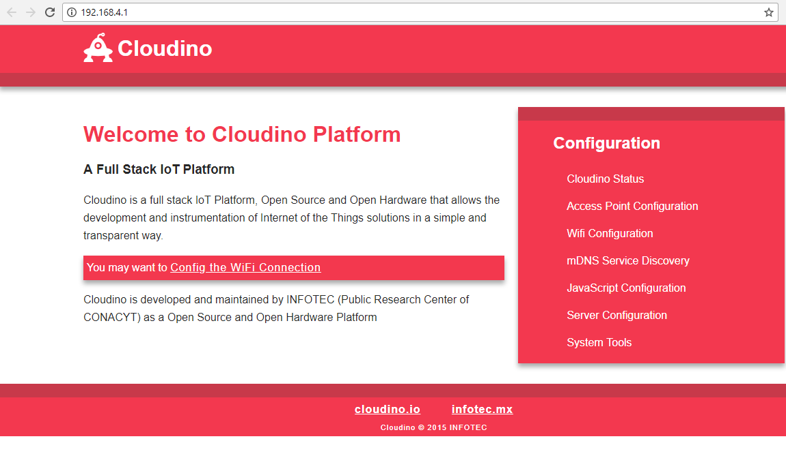
  *Fig. 9. CWC Configuration Panel on 192.168.4.1*

The association is done by accessing "Cloudino Cloud Configuration" found at
Server Configuration / Cloudino Server submenu. We need to copy/paste the Auth
Token generated from the Cloudino Platform into the "Auth Token" field and switch
the "Active" field to True, then click "Save" button as seen at Fig 10.

  
  *Fig. 10. Cloudino Cloud Configuration*

Lastly, the CWC needs to be configured to access Internet over a WiFi network to
be able to send data to the Cloudino Platform. Go to the WiFi Configuration menu,
scan your available WiFi networks and connect to your chosen one.
You can verify that the connection is correct when the "Status" changes to
**CONNECTED**.

  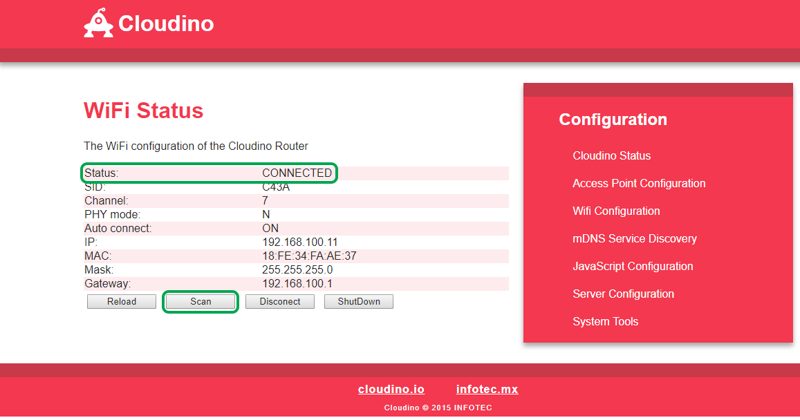
  *Fig. 11. WiFi Configuration Section.*

The connection between your CWC and [cloudino.io](http://cloudino.io/) is
established when the “Active” value is set to True in the Cloudino Cloud
Configuration.

### Verify connection between Cloudino Wifi Connector and Cloudino.io

To verify that your CWC is connected the Cloudino Platform you need to login again
to the Cloudino Platform and go to "Devices" menu. If the connection is working
properly you will see a green **"online"** legend aside your device created
previously.

***Be aware to properly disconnect your computer from the CWC WiFi and
connect to an internet WiFi network***

At this point your Cloudino/Arduino air quality sensor unit is ready to be programmed
and controlled by means of the [cloudino.io](http://cloudino.io/) tools.

  
  *Fig. 12. Cloudino device online and ready to be used.*

### Define your application's logic through the development tools from cloudino.io

Once a CWC is registered in [cloudino.io](http://cloudino.io/), we can proceed
to program it along with the associated hardware "Arduino UNO" and sensors showed
in Fig. 1. to define the behaviour of the IoT air quality monitoring application.

At first, we need to create a sketch –project- which has the same context and
meaning of the Arduino technology. You must select the **"Arduino"** section
from the dropdown menu indicated with **</>** icon and go to **"Sketchers"**,
where you can create or edit projects to be used on Arduino boards with the
Cloudino technology. Select the **"Add Sketcher"** option as seen on Fig. 13.

  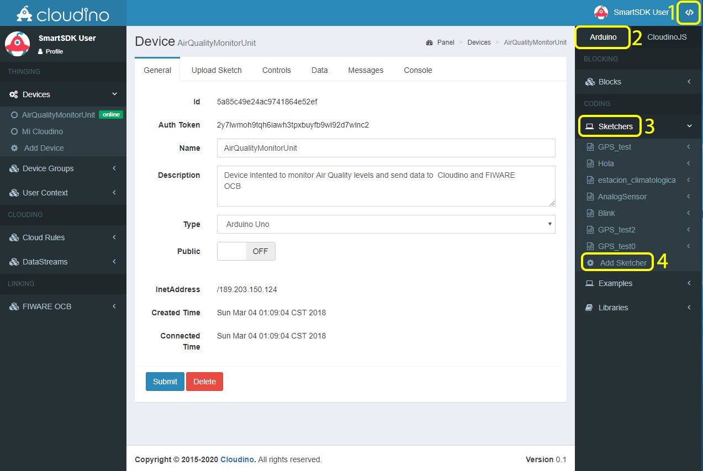
  *Fig. 13. Add Sketcher option in the Arduino menu*

Then, you must enter a name for your Sketch (a program used to control an
Arduino board), and press the "Submit" button, it will display a Sketcher
area as shown in Figs. 14, 15.

  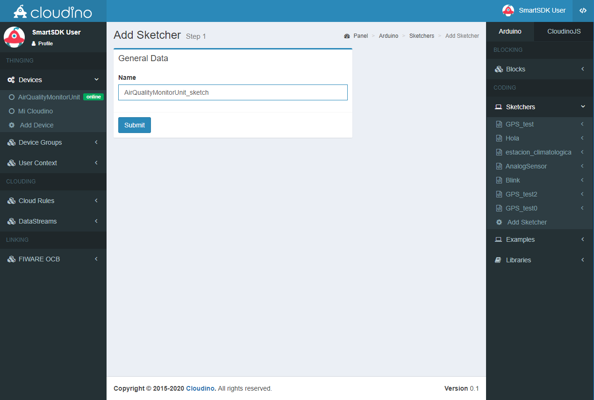
  *Fig. 14. Define the name of your sketcher*

  
  *Fig. 15. Sketcher area: compile, save and delete your code*

In Sketcher area, see Fig. 15, you can write the code to control Arduino,
CWC and sensors for remote monitoring of your air quality unit. The
code syntax is based on the Cloudino API (Application Programming Interface)
which is a variant from Arduino, making it easier to be adopted by former
and new arduino users. A broad description of the Cloudino API can be found
at <https://github.com/Cloudino/Cloudino-Doc>.

Below we can see the arduino code to be used in the development of our air
quality monitoring unit. It sends the raw values captured from the sensors
showed in the diagram from Fig. 1 to the Cloudino platform using a post method.

```c++
#include <Cloudino.h>
#include <dht11.h>
#define DHT11PIN 7

Cloudino cdino;
dht11 DHT11;

const int analogPinO3 = A0;
const int analogPinCO = A3;
const int analogPinNO2 = A4;

void setup()
{
  cdino.setInterval(10000,getSensors);
  cdino.begin();
}

void getSensors()
{
   int chk = DHT11.read(DHT11PIN);
   cdino.post("temperature",String((float)DHT11.temperature,2));
   cdino.post("relativeHumidity",String((float)DHT11.humidity,2));
   cdino.post("O3",String(analogRead(analogPinO3)));
   cdino.post("CO",String(analogRead(analogPinCO)));
   cdino.post("NO2",String(analogRead(analogPinNO2)));
   cdino.post("PM10",String(digitalRead(8)));
}

void loop()
{
   cdino.loop();
}
```

***The previous code captures the raw data from sensors except the DHT11
which makes use of its own library to calculate the correct temperature and
relative humidity. To properly represent the measurements from many sensors,
additional libraries might be needed***

Once the code for the sketch has been written, it must be saved and compiled to
verify that it is consistent with the Cloudino API, this process is performed
by clicking the "Compile" button as shown in Fig. 16. The blue box (Console)
shows the compilation status, here you can be aware of any compilation errors
and success. To solve any compilation problems you should consult the Cloudino
API on the [Cloudino website](https://github.com/Cloudino/Cloudino-Doc).

  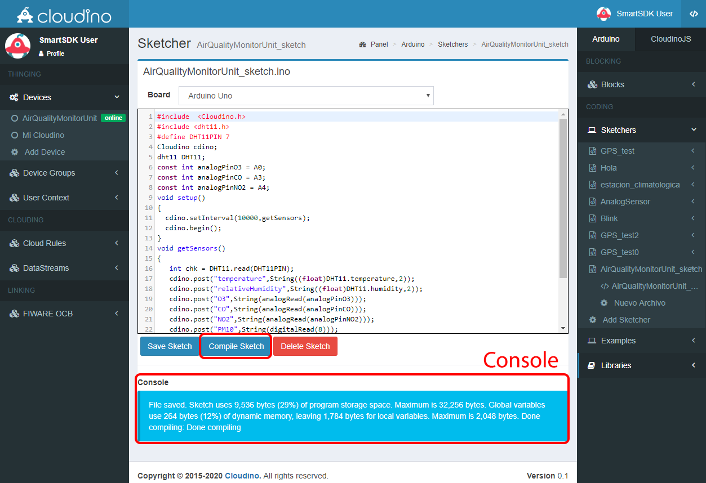
  *Fig 16. A sketch compiled with success*

Now, the created sketch must be loaded to the actual device. This is done by
using the "Upload Sketch" section within the selected device that is going to
be configured.

  
  *Fig. 17. “Upload Sketch” section from the selected device*

A list of sketches developed by the user and samples is shown. We need to select
the recently created sketch named "AirQualityMonitorUnit_sketch" and press the
"Upload Sketcher" button in order to flash the compiled code in the CWC memory
and the Arduino board to perform the developed functionality. The application
logic is stored after flashing concludes succesfully Figures 18 and 19 show the
process described above.

  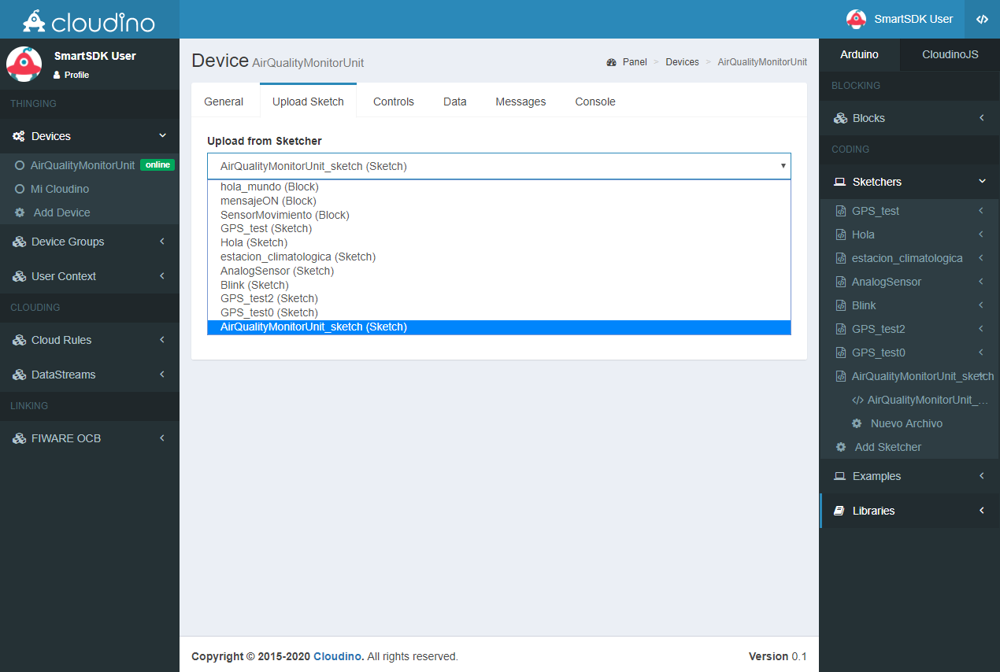
  *Fig. 18. Selecting a sketch for the device*

  
  *Fig. 19. Upload process of the sketch inside the CWC.*

At this point, the functionality of the system according to the Fig. 1 is working.
While the monitoring station is powered and connected to internet it will be
able to send measurements to the cloudino.io server; with that said, data can
be observed and used remotely.
The developed code periodically sends the values reported by the sensors each
second and displays them in the **"Messages"** section of the cloudino.io platform,
as shown in Fig. 20. The console is updated in real time indefinitely while
Cloudino is operating.

  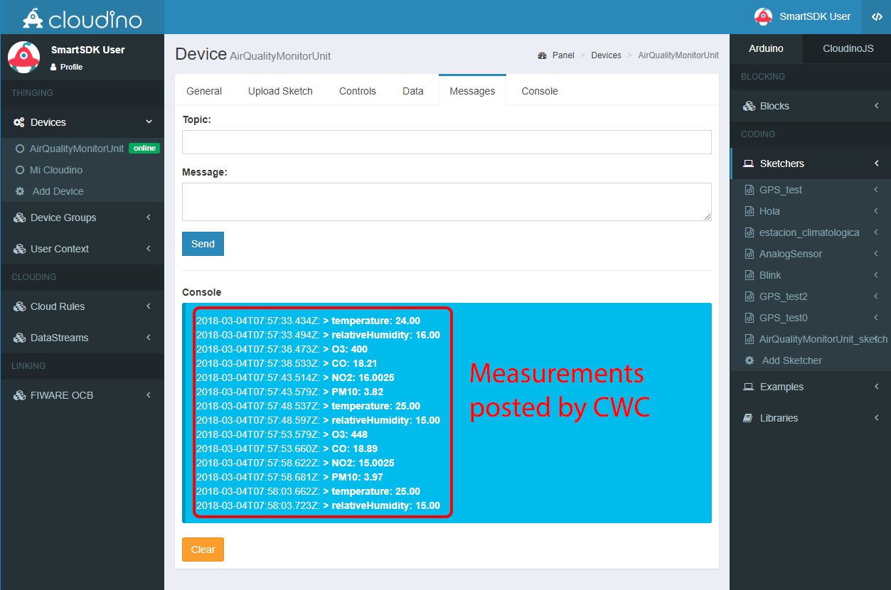
  *Fig. 20. Real-time measurements from your AirQuality monitoring unit*

## Your Cloudino as IoT Agent

The Cloudino itself operates as an IoT Agent able to work with FIWARE.
Its Cloudino Platform lets us connect to the FIWARE Orion Context Broker following
a simple series of steps.

To share the data of your developed air quality station in Cloudino with the
FIWARE platform, you must first enter the **"FIWARE OCB"** menu and select the
**"Add Entity"** option; this section helps you to define a link with the FIWARE
platform. As shown on Fig. 21, it is neccesary to define a name for the link,
a description and select a device (CWC) to be associated with the platform.
In this manner, the data collected by Cloudino can be shared with the FIWARE
platform.

  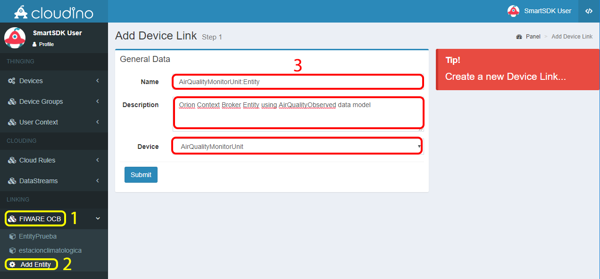
  *Fig. 21. Creating a link with the FIWARE platform*

Once a link has been created, a configuration panel is displayed (Fig 22)
where you can activate/deactivate the link, define the entity (data set) which
will be shared in the FIWARE platform as well as the OCB server address that
will be used to send the data and, when appropriate, the authentication data
required to connect to the server. Fig. 22 shows the definition of the entity
"AirQualityMonitorUnit:Entity" that includes all the data obtained from the
previously developed air quality monitoring unit.

  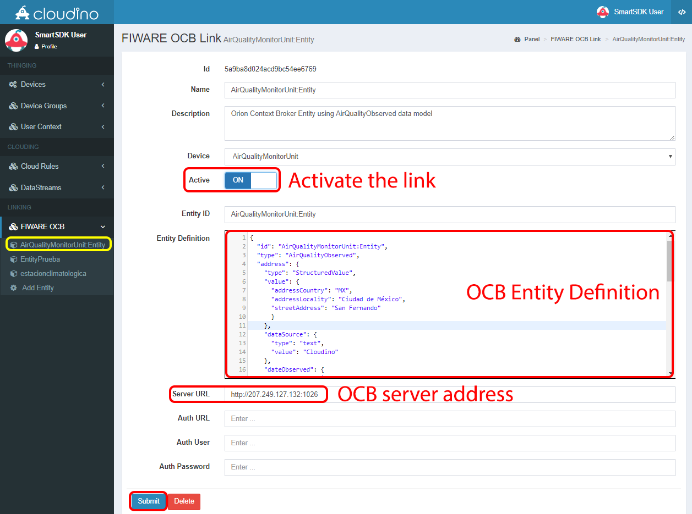
  *Fig. 22. Configuration panel of the FIWARE OCB Link and entity definition*

The following JSON code describes the entity “AirQualityMonitorUnit:Entity”
created in the previus step (Fig. 22):

```json
{
  "id": "AirQualityMonitorUnit:Entity",
  "type": "AirQualityObserved",
  "address": {
    "type": "StructuredValue",
    "value": {
      "addressCountry": "MX",
      "addressLocality": "Ciudad de México",
      "streetAddress": "San Fernando"
      }
    },
    "dataSource": {
      "type": "text",
      "value": "Cloudino"
    },
    "dateObserved": {
      "type": "DateTime",
      "value": "2018-02-01T17:00:00-05:00"
    },
    "location": {
      "value": {
        "type": "Point",
        "coordinates": [-99.163309, 19.291001]
      },
      "type": "geo:json"
    },
    "temperature": {
      "type": "text",
      "value": "12.2"
    },
    "relativeHumidity": {
      "type": "text",
      "value": "0.54"
    },
    "O3": {
      "type": "number",
      "value": "1.6"
    },
    "CO": {
      "type": "number",
      "value": "1.7"
    },
    "NO2": {
      "type": "number",
      "value": "1.9"
    },
    "PM10": {
      "type": "number",
      "value": "3.5"
    }
  }
```

***It is important to notice that the names of the variables used in cloudino must
be equal to the names defined in the attributes of the FIWARE entity model.***

After configuring the link, you must switch the "Active" option to **"ON"** and
define the entity (previous JSON code) to be shared with FIWARE, then click the
"Submit" button. It will automatically start to submit the data from the air
quality monitoring unit to the FIWARE OCB.

To verify the operation, we can access the associated OCB server defined in the
previous figure, i.e. <http://207.249.127.132:1026/v2> without any authentication.
In this way, Fig. 23. shows how the data defined in the entity and associated
with the Cloudino is displayed and updated in real time on the FIWARE OCB server.

  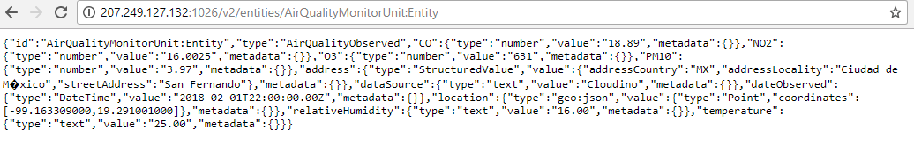
  *Fig. 23. Data of air quality monitoring unit in the FIWARe OCB*

As can be seen on Fig. 23, the data of the air quality monitoring unit can
be accessed with the following REST call:
<http://207.249.127.132:1026/v2/entities/AirQualityMonitorUnit:Entity>,

where we can see the real time information of the air quality monitoring
sensors controlled through the Cloudino platform. The information can now be
used by any kind of IoT application.

Further details to developed your IoT applications with Cloudino and integrate
with the FIWARE platform can be found here: <https://github.com/Cloudino/Cloudino-Doc>
