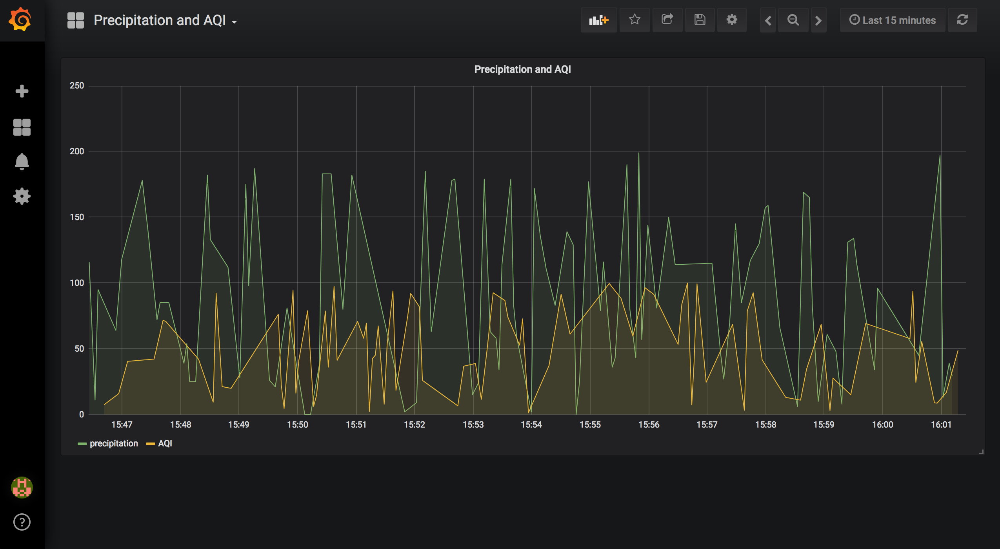

# Store historical data, query them and use them to create dashboards

## Prerequisites

This section of the guide starts assuming you have already
[deployed your platform](../platform/swarmcluster/)
and [deployed the core services](../platform/deployservices/). It also
assumes you have a data flow comming to your Orion Context Broker, as pointed
out in [this section](contextbroker/).

## Store Air Quality data from Context Broker in QuantumLeap

QuantumLeap tracks historical data of the entities when it receives NGSI
notifications about inserts in Orion. Therefore, we need to create an NGSI
subscription in Orion to notify QuantumLeap of changes in the entities for which
we want to keep historical records.

If you are well experienced with [Orion Subscriptions](http://fiware-orion.readthedocs.io/en/latest/user/walkthrough_apiv2/index.html#subscriptions),
you can create the subscription in Orion as you prefer, just make sure to use
the correct notify_url that the Orion instance would need to find QuantumLeap.

Otherwise, you can ask QuantumLeap to do it for you. For this, there is an API
endpoint `/v2/subscribe` that will create the subscription in Orion. By default,
it will create a subscription to receive notification for ALL changes of ALL
entities that enter Orion. For this guide this is good enough; however, if you
want to adjust the scope of notifications, have a look at the `/v2/ui` endpoint
of your deployed QL (e.g. `${QL_URL}/v2/ui`).

If you are using the [SmartSDK Postman Collection](https://github.com/smartsdk/smartsdk-recipes/blob/master/recipes/tools/postman_collection.json),
you have already a prepared call for this endpoint within the QuantumLeap folder
(QL Subscribe).

Otherwise, you can call the endpoint from the command line as follows
(mind the IPs)...

```
$ curl -X POST \
  '${QL_URL}/v2/subscribe?orionUrl=${ORION_URL}/v2&quantumleapUrl=http://quantumleap:8668/v2' \
  -H 'Accept: application/json'
```

You should have received a **201 CREATED** code from the previous POST.
If you want to double-check all worked fine, query Orion subscriptions and see
if you spot this subscription for QuantumLeap. You'll find this query in the
postman collection also, otherwise you can do it using curl...

```
$ curl -X GET ${ORION_URL}/v2/subscriptions/ -H 'Accept: application/json'
[{"id":"5ae2faa8cfdf0100fa49eb1f","description":"Created by QuantumLeap ...]
```

If you want to track specific entity types only, use one subscription per each
entity type.

At this point, you may be thinking "hold on, why asking QL to ask Orion to
notify him back?". The answer is, Orion remains the central piece of many FIWARE
deployments, and being a Broker, all information flows through it for the first
time.

## Query Air Quality data using QuantumLeap

QuantumLeap's Querying API is still under development, however you can already
make some tests with simple queries of historical data for 1 or N attributes of
a given entity.

You will find these queries in the Postman Collection, or you can try them from
the command line...

e.g.: Historical values of `airqualityobserved_0`'s `precipitation`.

```
$ curl -X GET \
  '${QL_URL}/v2/entities/airqualityobserved_0/attrs/precipitation?type=AirQualityObserved' \
  -H 'Accept: application/json'
```

e.g.: Last 4 Historical values of `airqualityobserved_0`'s `NO2` and `CO2`
attributes.

```
$ curl -X GET \
  '${QL_URL}/v2/entities/airqualityobserved_0?type=AirQualityObserved&attrs=NO2,CO&lastN=4' \
  -H 'Accept: application/json'
```

You can explore QuantumLeap's API at `${QL_URL}/v2/ui` or directly into the
[swagger specification](https://github.com/smartsdk/ngsi-timeseries-api/blob/master/specification/quantumleap.yml).

## Creating nice dashboards using QuantumLeap and Grafana

If you followed the section on [deploying your services](../platform/deployservices/),
you should have access to an instance of [Grafana](https://grafana.com/) almost
ready to interact with your historical data.

Let's assume you have your instance url saved in a variable called `GRAFANA_URL`.

```
export GRAFANA_URL=http://192.168.99.100:3000
```

Login to your instance `${GRAFANA_URL}/login`. The default
credentials are `admin`/`admin`, but remember to change them afterwards.

You need to first configure a datasource, which can only be done once you have
gone through the previous steps (i.e, QuantumLeap is already processing data).
Create one datasource per entity type you care about. Follow [these instructions](https://smartsdk.github.io/ngsi-timeseries-api/admin/grafana/).

You are now ready to create your dashboards using the datasources!. If you want
to have something to get started with, you can got to `${GRAFANA_URL}/dashboard/import`
and import the [grafana/dashboard_example.json](https://github.com/smartsdk/guided-tour/blob/master/docs/services/grafana/dashboard_example.json).
The result will look something like ...



Otherwise, we recommend you to read the
[official grafana docs](http://docs.grafana.org/guides/getting_started/).
